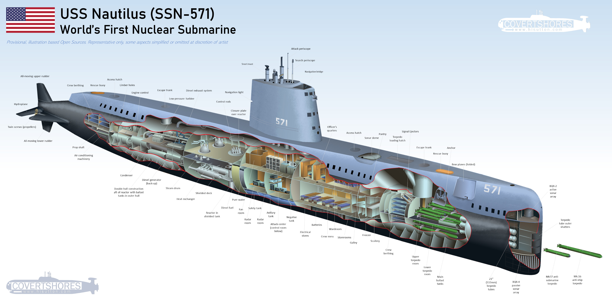

# Nuclear Nautilus

## Summary

|                |                                        |
| -------------- | -------------------------------------- |
| Author         | [Connor Vilenio](Connor%20Vilenio.md)  |
| Knowledge Base | [Obsidian](https://obsidian.md/)       |
| AI Assistance  | [ChatGPT](https://chat.openai.com/chat) |                                        |

Nuclear [Nautilus](Nautilus.md) is a project by [Connor Vilenio](Connor%20Vilenio.md) to organize and build a knowledge base of engineering know-how- particularly for [Software Engineering](Software%20Engineering.md).  The name of the project is inspired by Connor's study of [Admiral Hyman G. Rickover](Admiral%20Hyman%20G.%20Rickover.md), the "Father of the Nuclear Navy" and one of the all-time greatest engineers in history.  Rickover oversaw the creation of the first nuclear-powered submarine, the USS Nautilus, a milestone and monument to the possibilities of enginering excelence.

## Notes

- Any topics with names that start with `__` such as `__My Private Topic` are not shared on the public repository. Possible reasons include:
	- I don't have permission to share the content
	- Contains material discovered behind some public barrier such as a paywall.
	- I don't feel comfortable sharing the content
	- The content is truly private or secret

## Entrypoints

[Google Cloud Professional Cloud Architect Certification](Certifications/Google%20Cloud%20Professional%20Cloud%20Architect%20Certification.md)

- Test

